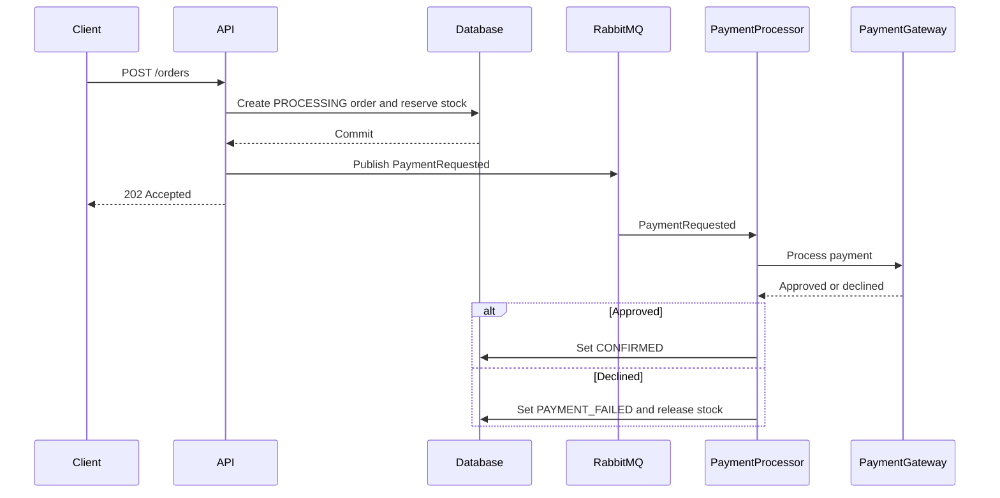

# Product Order API

REST backend for managing products and orders, developed with Java 21, Spring Boot, PostgreSQL, RabbitMq and Flyway.

## Prerequisites

- Java 21
- Docker Desktop running

## Run Locally

```powershell
docker compose up -d
mvn spring-boot:run
```

In a second terminal, start the frontend:

```powershell
cd frontend
npm.cmd install
npm.cmd run dev
```

The frontend is available at `http://localhost:5173`.

The API starts at `http://localhost:8080`. The Swagger UI is available at `http://localhost:8080/swagger-ui.html`.

The example CSV file provided for the challenge was downloaded on July 18, 2026.

## Routes

- `POST`, `GET`, `GET /{id}`, `PUT`, and `DELETE` for `/api/v1/products`
- `GET /api/v1/products` accepts the optional filters `name`, `sku`, `category`, `minPrice`, `maxPrice`, `minWeight`, and `maxWeight`
- `POST /api/v1/products/import` (`multipart/form-data`, `file` part)
- `POST`, `GET`, and `GET /{id}` for `/api/v1/orders` (`POST` requires `Idempotency-Key`)

## Authentication

Business endpoints require a Bearer JWT. Configure `JWT_ISSUER_URI`, `JWT_JWK_SET_URI`, and `JWT_AUDIENCE` for the identity provider used in your environment.

The health endpoint (`/actuator/health`) is publicly available.

## Asynchronous payment flow

`POST /api/v1/orders` requires `Idempotency-Key` and returns `202 Accepted` with `Location: /api/v1/orders/{id}`. The response contains the order ID and `PROCESSING` status.

Within one database transaction, the API creates the order, atomically reserves inventory, and changes the order to `PROCESSING`. After that transaction commits, it publishes a `PaymentRequested` message to RabbitMQ. The `PaymentProcessor` is only a messaging adapter; it delegates the business rules to `ProcessPaymentUseCase`.



Only one queue is consumed for processing: `payment.requested.queue`, bound to `ecommerce.payment.exchange` with routing key `payment.requested`. Before reaching it, messages spend 30 seconds in the technical `payment.requested.delay.queue`, using RabbitMQ TTL and dead-letter routing; this avoids requiring the delayed-message plugin. No approval or failure events are published because the consumer updates the order directly in this modular monolith. The dead-letter queue is `payment.requested.dlq`.

The fake gateway is deterministic: payments are approved by default; set `FAKE_PAYMENT_DECLINE=true` to simulate a business decline. A decline is not retried and moves the order to `PAYMENT_FAILED`, restoring the reserved stock in the same transaction. Technical failures are propagated to RabbitMQ, retried three times, and rejected to the DLQ after the retry limit.

RabbitMQ can deliver messages more than once. Each payment event has an `eventId`, persisted with a unique constraint in `processed_events`; duplicates are ignored. The current order status is a second protection against invalid or repeated processing.

## Why RabbitMQ?

RabbitMQ was intentionally selected as the asynchronous messaging solution for this take-home project.

The goal was to demonstrate a clear and production-oriented asynchronous payment workflow while keeping the solution small, understandable, and easy to run locally. RabbitMQ fits this scope well because it provides queues, acknowledgments, retries, and dead-letter handling without requiring a separate distributed-streaming platform.

Kafka was not selected because this use case does not require high-throughput event streaming, long-term event retention, replay, or multiple independent consumers. AWS-managed services were also not selected because the project is designed to run locally with Docker and should not depend on cloud credentials or external infrastructure.

This is a context-driven decision, not a general rule: Kafka or AWS services such as SQS could be more appropriate for different scale, operational, or platform requirements.

## RabbitMQ Management

Docker Compose starts RabbitMQ Management at `http://localhost:15672` with the local credentials `product_order` / `product_order`.

## Production considerations

Direct publishing after the database commit is intentional for this challenge: it keeps the design small and makes the asynchronous boundary explicit. It does **not** provide atomicity between PostgreSQL and RabbitMQ. If publication fails after the commit, the order remains `PROCESSING`, the error is propagated and logged, and it can be diagnosed or reprocessed manually.

For stricter production delivery guarantees, the recommended evolution is the Transactional Outbox Pattern. It is deliberately not implemented here.

## Local JWT (Keycloak)

Running `docker compose up -d` also starts Keycloak at `http://localhost:8081` and automatically imports the `product-order` realm. The local `product-order-api` client uses a service account and already includes the audience required by the API.

To obtain a development JWT, import [the Postman collection](postman/Product-Order-API.postman_collection.json) and run the `Authentication > Generate JWT` request. The request stores the returned access token in the `jwt` collection variable, which is automatically used by the protected API requests.

The `admin/admin` credentials and the client secret included in the collection are for local development only.

## Tests

```powershell
mvn test
```

Integration tests use Testcontainers, follow the `*IT` convention, and require a running Docker Engine:

```powershell
mvn verify -Pintegration
```

